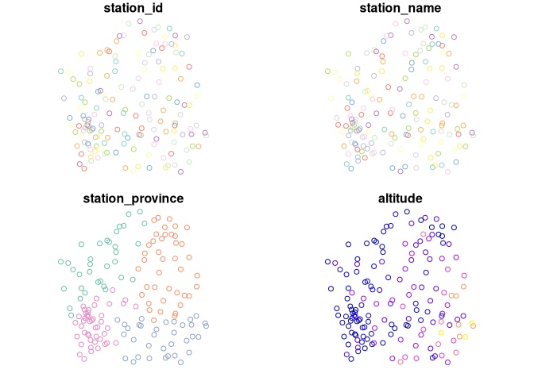

# meteospain

[](https://github.com/emf-creaf/meteospain/actions)

`meteospain` aims to offer access to different Spanish meteorological
stations data in an uniform way.

## Installation

`meteospain` is in CRAN, and can be installed as any other package:

``` r
install.packages('meteospain')
```

Also, `meteospain` is in active development. You can install the
development version from [GitHub](https://github.com/) with:

``` r
# install.packages("remotes")
remotes::install_github("emf-creaf/meteospain")
```

## Services

The following meteorological stations services are available:

- [AEMET](https://www.aemet.es/en/portada), the Spanish State
  Meteorological Agency.
- [MeteoCat](https://meteo.cat), the Catalan Meteorology Service.
- [MeteoGalicia](https://www.meteogalicia.gal/web/inicio.action), the
  Galician Meteorological Service.
- [RIA](https://www.juntadeandalucia.es/agriculturaypesca/ifapa/riaweb/web/),
  the Andalucian Agroclimatic Information Network.
- [Meteoclimatic](https://www.meteoclimatic.net/), the Spanish
  non-professional meteorological stations network.

## Examples

Access to the services is done with the `get_meteo_from` function,
providing the name of the service and the options. Each service has a
dedicated `*service*_options()` function to guide through the specifics
of each service:

``` r
library(meteospain)

mg_options <- meteogalicia_options(resolution = 'current_day')
get_meteo_from('meteogalicia', mg_options)
#> ℹ A información divulgada a través deste servidor ofrécese gratuitamente aos
#>   cidadáns para que poida ser
#> utilizada libremente por eles, co único compromiso de mencionar expresamente a
#> MeteoGalicia e á
#> Consellería de Medio Ambiente, Territorio e Vivenda da Xunta de Galicia como
#> fonte da mesma cada vez
#> que as utilice para os usos distintos do particular e privado.
#> https://www.meteogalicia.gal/web/informacion/notaIndex.action
#> Simple feature collection with 3768 features and 14 fields
#> Geometry type: POINT
#> Dimension:     XY
#> Bounding box:  xmin: -9.178318 ymin: 41.8982 xmax: -6.765224 ymax: 43.734
#> Geodetic CRS:  WGS 84
#> # A tibble: 3,768 × 15
#>    timestamp           service   stati…¹ stati…² stati…³ altit…⁴ tempe…⁵ min_t…⁶
#>    <dttm>              <chr>     <chr>   <chr>   <chr>       [m]    [°C]    [°C]
#>  1 2023-03-15 10:00:00 meteogal… 10045   Mabego… A Coru…      94   14.4    13.9 
#>  2 2023-03-15 10:00:00 meteogal… 10046   Marco … A Coru…     651    8.65    8.13
#>  3 2023-03-15 10:00:00 meteogal… 10047   Pedro … Lugo         51   14.1    13.7 
#>  4 2023-03-15 10:00:00 meteogal… 10048   O Inve… Ourense    1026    9.98    8.3 
#>  5 2023-03-15 10:00:00 meteogal… 10049   Corrub… A Coru…      30   14.3    13.6 
#>  6 2023-03-15 10:00:00 meteogal… 10050   CIS Fe… A Coru…      37   13.9    13.3 
#>  7 2023-03-15 10:00:00 meteogal… 10052   Muralla A Coru…     661    9.2     8.79
#>  8 2023-03-15 10:00:00 meteogal… 10053   Campus… Lugo        400    8.85    6.79
#>  9 2023-03-15 10:00:00 meteogal… 10055   Guitir… Lugo        684    8.54    7.42
#> 10 2023-03-15 10:00:00 meteogal… 10056   Marroxo Lugo        645    8.22    7.06
#> # … with 3,758 more rows, 7 more variables: max_temperature [°C],
#> #   relative_humidity [%], precipitation [L/m^2], wind_direction [°],
#> #   wind_speed [m/s], insolation [h], geometry <POINT [°]>, and abbreviated
#> #   variable names ¹​station_id, ²​station_name, ³​station_province, ⁴​altitude,
#> #   ⁵​temperature, ⁶​min_temperature
```

Stations info can be accessed with `get_stations_info_from` function:

``` r
get_stations_info_from('meteogalicia', mg_options)
#> Simple feature collection with 158 features and 5 fields
#> Geometry type: POINT
#> Dimension:     XY
#> Bounding box:  xmin: -9.178318 ymin: 41.8982 xmax: -6.765224 ymax: 43.7383
#> Geodetic CRS:  WGS 84
#> # A tibble: 158 × 6
#>    service      station_id station_n…¹ stati…² altit…³             geometry
#>  * <chr>        <chr>      <chr>       <chr>       [m]          <POINT [°]>
#>  1 meteogalicia 10157      Coruña-Tor… A Coru…      21 (-8.409202 43.38276)
#>  2 meteogalicia 14000      Coruña-Diq… A Coru…       5 (-8.374706 43.36506)
#>  3 meteogalicia 10045      Mabegondo   A Coru…      94 (-8.262225 43.24137)
#>  4 meteogalicia 14003      Punta Lang… A Coru…       5 (-8.531179 43.34723)
#>  5 meteogalicia 10144      Arzúa       A Coru…     362  (-8.17469 42.93196)
#>  6 meteogalicia 19005      Guísamo     A Coru…     175 (-8.276487 43.30799)
#>  7 meteogalicia 19012      Cespón      A Coru…      59 (-8.854571 42.67466)
#>  8 meteogalicia 10095      Sergude     A Coru…     231 (-8.461246 42.82283)
#>  9 meteogalicia 10800      Camariñas   A Coru…       5 (-9.178318 43.12445)
#> 10 meteogalicia 19001      Rus         A Coru…     134 (-8.685357 43.15616)
#> # … with 148 more rows, and abbreviated variable names ¹​station_name,
#> #   ²​station_province, ³​altitude
```

Returned objects are spatial objects (using the
[`sf`](https://r-spatial.github.io/sf/) R package), so results can be
plotted directly:

``` r
library(sf)
#> Linking to GEOS 3.11.1, GDAL 3.6.3, PROJ 9.1.0; sf_use_s2() is TRUE
mg_options <- meteogalicia_options(resolution = 'daily', start_date = as.Date('2021-04-25'))
plot(get_meteo_from('meteogalicia', mg_options))
#> ℹ A información divulgada a través deste servidor ofrécese gratuitamente aos
#>   cidadáns para que poida ser
#> utilizada libremente por eles, co único compromiso de mencionar expresamente a
#> MeteoGalicia e á
#> Consellería de Medio Ambiente, Territorio e Vivenda da Xunta de Galicia como
#> fonte da mesma cada vez
#> que as utilice para os usos distintos do particular e privado.
#> https://www.meteogalicia.gal/web/informacion/notaIndex.action
#> Warning: plotting the first 9 out of 16 attributes; use max.plot = 16 to plot
#> all
```


``` r

plot(get_stations_info_from('meteogalicia', mg_options))
```



## API keys

Some services, like AEMET or Meteocat, require an *API key* to access
the data. `meteospain` **doesn’t** provide any key for those services,
see `?services_options` for information about this.

Once a key has been obtained, we can get the meteo:

``` r
get_meteo_from('aemet', aemet_options(api_key = keyring::key_get("aemet")))
#> ℹ © AEMET. Autorizado el uso de la información y su reproducción citando a
#>   AEMET como autora de la misma.
#> https://www.aemet.es/es/nota_legal
#> Simple feature collection with 18949 features and 14 fields
#> Geometry type: POINT
#> Dimension:     XY
#> Bounding box:  xmin: -18.115 ymin: 27.66667 xmax: 4.316389 ymax: 43.78621
#> Geodetic CRS:  WGS 84
#> # A tibble: 18,949 × 15
#>    timestamp           service station…¹ stati…² stati…³ altit…⁴ tempe…⁵ min_t…⁶
#>    <dttm>              <chr>   <chr>     <chr>   <chr>       [m]    [°C]    [°C]
#>  1 2023-03-15 10:00:00 aemet   0009X     ALFORJA <NA>        406    14.9    13.7
#>  2 2023-03-15 10:00:00 aemet   0016A     REUS/A… <NA>         71    16.9    15.2
#>  3 2023-03-15 10:00:00 aemet   0034X     VALLS   <NA>        233    16.2    14.8
#>  4 2023-03-15 10:00:00 aemet   0042Y     TARRAG… <NA>         55    15.6    15.4
#>  5 2023-03-15 10:00:00 aemet   0061X     PONTONS <NA>        632    13.7    11.3
#>  6 2023-03-15 10:00:00 aemet   0066X     VILAFR… <NA>        177    14.8    13.2
#>  7 2023-03-15 10:00:00 aemet   0073X     SITGES… <NA>         58    17      15.6
#>  8 2023-03-15 10:00:00 aemet   0076      BARCEL… <NA>          4    15.6    13.8
#>  9 2023-03-15 10:00:00 aemet   0092X     BERGA … <NA>        682    12.1    11  
#> 10 2023-03-15 10:00:00 aemet   0106X     BALSAR… <NA>        361    12.4    10.3
#> # … with 18,939 more rows, 7 more variables: max_temperature [°C],
#> #   relative_humidity [%], precipitation [L/m^2], wind_direction [°],
#> #   wind_speed [m/s], insolation [h], geometry <POINT [°]>, and abbreviated
#> #   variable names ¹​station_id, ²​station_name, ³​station_province, ⁴​altitude,
#> #   ⁵​temperature, ⁶​min_temperature
```
