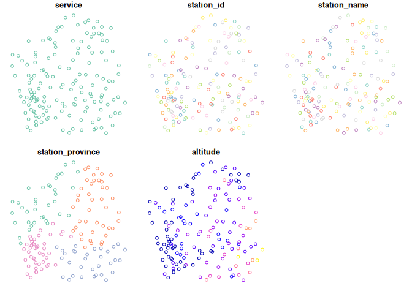

<!-- README.md is generated from README.Rmd. Please edit that file -->

# meteospain

<!-- badges: start -->
<!-- badges: end -->

`meteospain` aims to offer access to different spanish meteorological
stations data in an uniform way.

## Installation

`meteospain` is yet in active development. You can install the
development version from [GitHub](https://github.com/) with:

``` r
# install.packages("remotes")
remotes::install_github("emf-creaf/meteospain")
```

## Services

The following meteorological stations services are available:

-   [AEMET](http://www.aemet.es/en/portada), the spanish State
    Meteorological Agency.
-   [MeteoGalicia](https://www.meteogalicia.gal/web/inicio.action), the
    galician meteorological service.
-   [Meteoclimatic](https://www.meteoclimatic.net/), the spanish
    non-professional meteorological stations network.

## Examples

Access to the services is done with the `get_meteo_from` function,
providing the name of the service and the options. Each service has a
dedicated options function to guide thorugh the especifics of each
service:

``` r
library(meteospain)

mg_options <- meteogalicia_options(resolution = 'current_day')
get_meteo_from('meteogalicia', mg_options)
#> A información divulgada a través deste servidor ofrécese gratuitamente aos cidadáns para que poida ser  utilizada libremente por eles, co único compromiso de mencionar expresamente a MeteoGalicia e á  Consellería de Medio Ambiente, Territorio e Vivenda da Xunta de Galicia como fonte da mesma cada vez  que as utilice para os usos distintos do particular e privado.
#> https://www.meteogalicia.gal/web/informacion/notaIndex.action
#> Simple feature collection with 3660 features and 13 fields
#> Geometry type: POINT
#> Dimension:     XY
#> Bounding box:  xmin: -9.178318 ymin: 41.8982 xmax: -6.765224 ymax: 43.734
#> Geodetic CRS:  WGS 84
#> # A tibble: 3,660 x 14
#>    timestamp           station_id station_name     station_province altitude
#>    <dttm>              <chr>      <chr>            <chr>                 [m]
#>  1 2021-05-12 13:00:00 10045      Mabegondo        A Coruña               94
#>  2 2021-05-12 13:00:00 10046      Marco da Curra   A Coruña              651
#>  3 2021-05-12 13:00:00 10047      Pedro Murias     Lugo                   51
#>  4 2021-05-12 13:00:00 10048      O Invernadeiro   Ourense              1026
#>  5 2021-05-12 13:00:00 10049      Corrubedo        A Coruña               30
#>  6 2021-05-12 13:00:00 10050      CIS Ferrol       A Coruña               37
#>  7 2021-05-12 13:00:00 10052      Muralla          A Coruña              661
#>  8 2021-05-12 13:00:00 10053      Campus Lugo      Lugo                  400
#>  9 2021-05-12 13:00:00 10055      Guitiriz-Mirador Lugo                  684
#> 10 2021-05-12 13:00:00 10057      Alto do Rodicio  Ourense               981
#> # … with 3,650 more rows, and 9 more variables: temperature [°C],
#> #   min_temperature [°C], max_temperature [°C], relative_humidity [%],
#> #   precipitation [L/m2], wind_direction [°], wind_speed [m/s], insolation [h],
#> #   geometry <POINT [°]>
```

Stations info can be accessed with `get_stations_info_from` function:

``` r
get_stations_info_from('meteogalicia', mg_options)
#> Simple feature collection with 154 features and 4 fields
#> Geometry type: POINT
#> Dimension:     XY
#> Bounding box:  xmin: -9.178318 ymin: 41.8982 xmax: -6.765224 ymax: 43.734
#> Geodetic CRS:  WGS 84
#> # A tibble: 154 x 5
#>    station_id station_name     station_province altitude                geometry
#>  * <chr>      <chr>            <chr>                 [m]             <POINT [°]>
#>  1 10157      Coruña-Torre de… A Coruña               21    (-8.409202 43.38276)
#>  2 14000      Coruña-Dique     A Coruña                5    (-8.374706 43.36506)
#>  3 10045      Mabegondo        A Coruña               94    (-8.262225 43.24137)
#>  4 14003      Punta Langostei… A Coruña                5    (-8.531179 43.34723)
#>  5 10144      Arzúa            A Coruña              362     (-8.17469 42.93196)
#>  6 19005      Guísamo          A Coruña              175    (-8.276487 43.30799)
#>  7 19012      Cespón           A Coruña               59    (-8.854571 42.67466)
#>  8 10095      Sergude          A Coruña              231    (-8.461246 42.82283)
#>  9 10800      Camariñas        A Coruña                5    (-9.178318 43.12445)
#> 10 19001      Rus              A Coruña              134    (-8.685357 43.15616)
#> # … with 144 more rows
```

Returned objects are spatial objects (thanks to the
[`sf`](https://r-spatial.github.io/sf/) R package), so we can plot the
results directly.

``` r
library(sf)
#> Linking to GEOS 3.9.1, GDAL 3.2.2, PROJ 8.0.0
mg_options <- meteogalicia_options(resolution = 'daily', start_date = as.Date('2021-04-25'))
plot(get_meteo_from('meteogalicia', mg_options))
#> A información divulgada a través deste servidor ofrécese gratuitamente aos cidadáns para que poida ser  utilizada libremente por eles, co único compromiso de mencionar expresamente a MeteoGalicia e á  Consellería de Medio Ambiente, Territorio e Vivenda da Xunta de Galicia como fonte da mesma cada vez  que as utilice para os usos distintos do particular e privado.
#> https://www.meteogalicia.gal/web/informacion/notaIndex.action
#> Warning: plotting the first 9 out of 15 attributes; use max.plot = 15 to plot
#> all
```


``` r
plot(get_stations_info_from('meteogalicia', mg_options))
```


