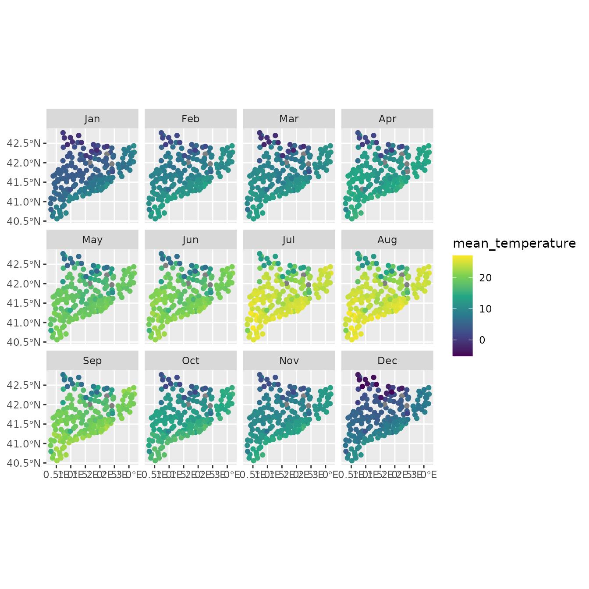

# MeteoCat service

``` r
library(meteospain)
library(dplyr)
#> 
#> Attaching package: 'dplyr'
#> The following objects are masked from 'package:stats':
#> 
#>     filter, lag
#> The following objects are masked from 'package:base':
#> 
#>     intersect, setdiff, setequal, union
library(ggplot2)
library(ggforce)
library(units)
#> udunits database from /usr/share/xml/udunits/udunits2.xml
library(sf)
#> Linking to GEOS 3.12.1, GDAL 3.8.4, PROJ 9.4.0; sf_use_s2() is TRUE
library(keyring)
```

## MeteoCat service

[MeteoCat](https://www.meteo.cat/) is the Catalonian meteorologic
service. It offers access to different meteorological data and
information, being one of their main missions to curate and circulate
data from meteorological stations. `meteospain` only access to the
automatic meteorological stations network data.

### MeteoCat options

#### Temporal resolution

`meteospain` offers access to the MeteoCat API at different temporal
resolutions:

- “instant”, returning the latest 4 hours of measures for all or
  selected stations.
- “hourly”, returning all measures (some stations has timesteps of 30
  min, others 60 min, others more) for all or selected stations.
- “daily”, returning daily aggregates for the month in the date
  provided, i.e. if ‘2020-04-10’ is provided as start_date, all daily
  values for April 2020 will be returned.
- “monthly”, returning monthly aggregates for the year in the date
  provided, i.e. if ‘2020-04-10’ is provided as start_date, all monthly
  values for 2020 will be returned.
- “yearly”, returning yearly aggregates for all years available. In this
  case date provided is ignored.

In “daily” and “monthly”, a `start_date` argument must be provided,
indicating the date from which retrieve the data as explained earlier.
For more info see
[`vignette('api_limits', package = 'meteospain')`](https://emf-creaf.github.io/meteospain/articles/api_limits.md).

#### Stations

`meteospain` access the data in the MeteoCat API collecting all
stations. If a character vector of stations codes is supplied in the
`stations` argument, a filter step is done before returning the data to
maintain only the stations supplied.

#### MeteoCat API Key

MeteoCat API only allow access to the data with a personal API Key. This
token must be included in the `api_key` argument of `meteocat_options`
function.  
To obtain the API Key, please visit
<https://apidocs.meteocat.gencat.cat/> and follow the instructions
there.

> It is not advisable to use the keys directly in any script shared or
> publicly available (github…), neither store them in plain text files.
> One option is using the [keyring
> package](https://github.com/r-lib/keyring) for managing and accessing
> keys:

``` r
install.packages('keyring')
library(keyring)
key_set('meteocat') # A prompt asking for the secret (the API Key) will appear.
```

#### Examples

``` r
# current day, all stations
api_options <- meteocat_options(
  resolution = 'instant',
  api_key = key_get('meteocat')
)
api_options
```

    #> $resolution
    #> [1] "instant"
    #> 
    #> $start_date
    #> [1] "2025-11-11"
    #> 
    #> $stations
    #> NULL
    #> 
    #> $api_key
    #> [1] "my_api_key"

``` r
# daily, all stations
api_options <- meteocat_options(
  resolution = 'daily',
  start_date = as.Date('2020-04-10'),
  api_key = key_get('meteocat')
)
api_options
```

    #> $resolution
    #> [1] "daily"
    #> 
    #> $start_date
    #> [1] "2020-04-25"
    #> 
    #> $stations
    #> NULL
    #> 
    #> $api_key
    #> [1] "my_api_key"

### MeteoCat stations info

Accessing station metadata for MeteoCat is simple:

``` r
get_stations_info_from('meteocat', api_options)
#> Simple feature collection with 245 features and 5 fields
#> Geometry type: POINT
#> Dimension:     XY
#> Bounding box:  xmin: 0.30565 ymin: 40.55219 xmax: 3.18147 ymax: 42.77011
#> Geodetic CRS:  WGS 84
#> # A tibble: 245 × 6
#>    service  station_id station_name                   station_province altitude
#>  * <chr>    <chr>      <chr>                          <chr>                 [m]
#>  1 meteocat AN         Barcelona - Av. Lluís Companys Barcelona             7.5
#>  2 meteocat C6         Castellnou de Seana            Lleida              264  
#>  3 meteocat C7         Tàrrega                        Lleida              427  
#>  4 meteocat C8         Cervera                        Lleida              554  
#>  5 meteocat C9         Mas de Barberans               Tarragona           240  
#>  6 meteocat CA         Clariana de Cardener           Lleida              693  
#>  7 meteocat CB         les Llosses                    Girona              700  
#>  8 meteocat CC         Orís                           Barcelona           626  
#>  9 meteocat CD         la Seu d'Urgell - Bellestar    Lleida              849  
#> 10 meteocat CE         els Hostalets de Pierola       Barcelona           316  
#> # ℹ 235 more rows
#> # ℹ 1 more variable: geometry <POINT [°]>
```

### MeteoCat data

``` r
api_options <- meteocat_options(
  resolution = 'monthly',
  start_date = as.Date('2020-04-01'),
  api_key = key_get('meteocat')
)
catalunya_2020 <- get_meteo_from('meteocat', options = api_options)
#> iterating ■■■                                8% | ETA: 17s
#> iterating ■■■■■■                            18% | ETA: 16s
#> iterating ■■■■■■■■■■■                       33% | ETA: 13s
#> iterating ■■■■■■■■■■■■■■■■■                 54% | ETA:  8s
#> iterating ■■■■■■■■■■■■■■■■■■■■■■            69% | ETA:  6s
#> iterating ■■■■■■■■■■■■■■■■■■■■■■■■■■■       87% | ETA:  2s
#> iterating ■■■■■■■■■■■■■■■■■■■■■■■■■■■■■■■  100% | ETA:  0s
#> ℹ Data provided by meteo.cat © Servei Meteorològic de Catalunya
#> https://www.meteo.cat/wpweb/avis-legal/#info
catalunya_2020
#> Simple feature collection with 2255 features and 45 fields
#> Geometry type: POINT
#> Dimension:     XY
#> Bounding box:  xmin: 0.30565 ymin: 40.55786 xmax: 3.18147 ymax: 42.77011
#> Geodetic CRS:  WGS 84
#> # A tibble: 2,255 × 46
#>    timestamp           service station_id station_name station_province altitude
#>  * <dttm>              <chr>   <chr>      <chr>        <chr>                 [m]
#>  1 2020-01-01 00:00:00 meteoc… C6         Castellnou … Lleida               264 
#>  2 2020-01-01 00:00:00 meteoc… C7         Tàrrega      Lleida               427 
#>  3 2020-01-01 00:00:00 meteoc… C8         Cervera      Lleida               554 
#>  4 2020-01-01 00:00:00 meteoc… C9         Mas de Barb… Tarragona            240 
#>  5 2020-01-01 00:00:00 meteoc… CC         Orís         Barcelona            626 
#>  6 2020-01-01 00:00:00 meteoc… CD         la Seu d'Ur… Lleida               849 
#>  7 2020-01-01 00:00:00 meteoc… CE         els Hostale… Barcelona            316 
#>  8 2020-01-01 00:00:00 meteoc… CG         Molló - Fab… Girona              1405 
#>  9 2020-01-01 00:00:00 meteoc… CI         Sant Pau de… Girona               852 
#> 10 2020-01-01 00:00:00 meteoc… CJ         Organyà      Lleida               566.
#> # ℹ 2,245 more rows
#> # ℹ 40 more variables: mean_temperature [°C], mean_temperature_classic [°C],
#> #   min_temperature_absolute [°C], min_temperature_mean [°C],
#> #   max_temperature_absolute [°C], max_temperature_mean [°C],
#> #   max_thermal_amplitude [°C], mean_thermal_amplitude [°C],
#> #   extreme_thermal_amplitude [°C], mean_relative_humidity [%],
#> #   min_relative_humidity_absolute [%], min_relative_humidity_mean [%], …
```

Visually:

``` r
catalunya_2020 |>
  units::drop_units() |>
  mutate(month = lubridate::month(timestamp, label = TRUE)) |>
  ggplot() +
  geom_sf(aes(colour = mean_temperature)) +
  facet_wrap(vars(month), ncol = 4) +
  scale_colour_viridis_c()
```



``` r

catalunya_2020 |>
  mutate(month = lubridate::month(timestamp, label = TRUE)) |>
  ggplot() +
  geom_histogram(aes(x = precipitation)) +
  facet_wrap(vars(month), ncol = 4)
#> `stat_bin()` using `bins = 30`. Pick better value `binwidth`.
#> Warning: Removed 25 rows containing non-finite outside the scale range
#> (`stat_bin()`).
```


