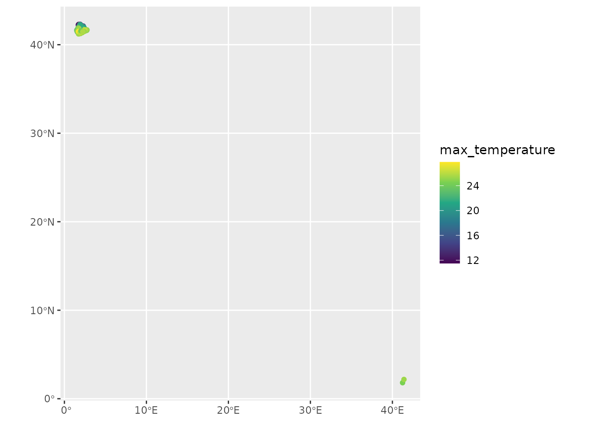
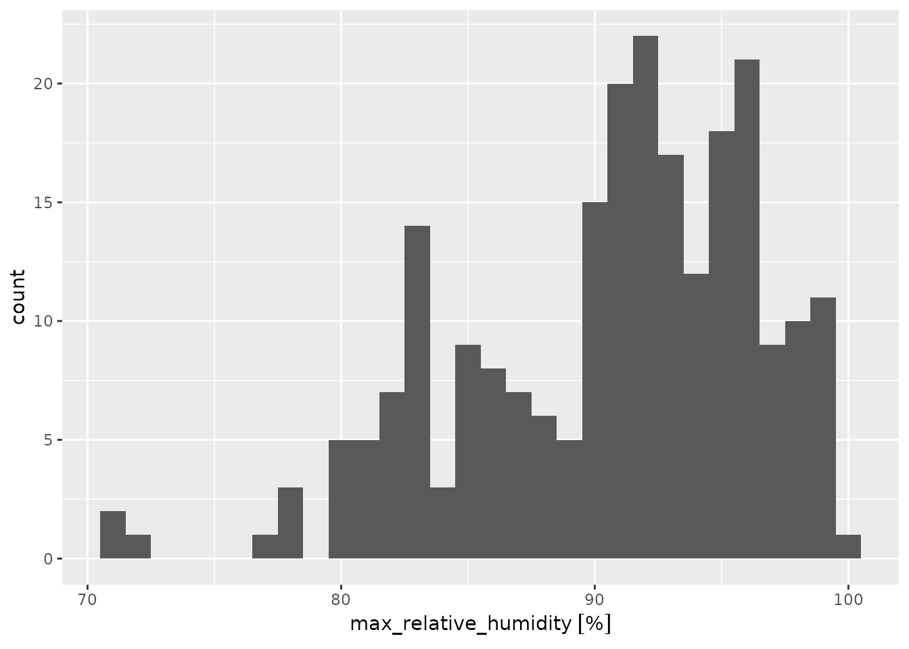

# Meteoclimatic service

``` r
library(meteospain)
library(ggplot2)
library(ggforce)
library(units)
#> udunits database from /usr/share/xml/udunits/udunits2.xml
library(sf)
#> Linking to GEOS 3.12.1, GDAL 3.8.4, PROJ 9.4.0; sf_use_s2() is TRUE
```

## Meteoclimatic service

[Meteoclimatic](https://www.meteoclimatic.net/) is a non-professional
(amateur) network of automatic meteorological stations. This network
cover all Spain, but does not offer quality testing of the data.

### Meteoclimatic options

#### Temporal resolution

Meteoclimatic API only offers aggregated data for the current day, so,
in this case the `resolution` parameter is limited to “current_day”.

#### Stations

Meteoclimatic API does not accept multiple stations in the same query.
But it has station codes that can access the data from several stations
in the same geographic area (i.e. “ES” for all stations, “ESCAT” for all
stations in Catalunya, “ESCAT08” for all stations in Barcelona
province). So, the `stations` is limited at length one.

#### Example

``` r
api_options <- meteoclimatic_options(stations = 'ESCAT08')
api_options
#> $resolution
#> [1] "current_day"
#> 
#> $stations
#> [1] "ESCAT08"
```

### Meteoclimatic stations info

Accessing station metadata for Meteoclimatic is simple:

``` r
get_stations_info_from('meteoclimatic', options = api_options)
#> Simple feature collection with 223 features and 3 fields
#> Geometry type: POINT
#> Dimension:     XY
#> Bounding box:  xmin: 1.52 ymin: 1.81 xmax: 41.64 ymax: 42.3
#> Geodetic CRS:  WGS 84
#> # A tibble: 223 × 4
#>    service       station_id          station_name          geometry
#>  * <chr>         <chr>               <chr>              <POINT [°]>
#>  1 meteoclimatic ESCAT0800000008328F Alella-Mirador (… (2.29 41.49)
#>  2 meteoclimatic ESCAT0800000008350A Arenys de Mar (B… (2.56 41.59)
#>  3 meteoclimatic ESCAT0800000008310B Argentona (Barce… (2.39 41.56)
#>  4 meteoclimatic ESCAT0800000008610B Avià (Barcelona)  (1.83 42.08)
#>  5 meteoclimatic ESCAT0800000008610A Avià - Sud (Barc… (1.83 42.07)
#>  6 meteoclimatic ESCAT0800000008915C Badalona - BCIN … (2.26 41.46)
#>  7 meteoclimatic ESCAT0800000008915A Badalona - Bufal… (2.24 41.46)
#>  8 meteoclimatic ESCAT0800000008912A Badalona - Centr… (2.25 41.45)
#>  9 meteoclimatic ESCAT0800000008911C Badalona - Dalt … (2.26 41.46)
#> 10 meteoclimatic ESCAT0800000008080A Badalona - Llefi… (2.23 41.44)
#> # ℹ 213 more rows
```

### Meteoclimatic data

``` r
current_day_barcelona <- get_meteo_from('meteoclimatic', options = api_options)
#> ℹ Meteoclimatic is a non-professional network of automatic meteorological
#>   stations.
#> No quality check is performed in this data, and errors in measures or
#> coordinates of stations can be present.
#> https://www.meteoclimatic.net/index
current_day_barcelona
#> Simple feature collection with 223 features and 13 fields
#> Geometry type: POINT
#> Dimension:     XY
#> Bounding box:  xmin: 1.52 ymin: 1.81 xmax: 41.64 ymax: 42.3
#> Geodetic CRS:  WGS 84
#> # A tibble: 223 × 14
#>    timestamp           service       station_id     station_name min_temperature
#>  * <dttm>              <chr>         <chr>          <chr>                   [°C]
#>  1 2026-02-12 11:30:00 meteoclimatic ESCAT08000000… La Pobla de…             5.3
#>  2 2026-02-12 11:30:00 meteoclimatic ESCAT08000000… Pedraforca-…            -5.2
#>  3 2026-02-12 11:33:25 meteoclimatic ESCAT08000000… Palau Solit…            11.7
#>  4 2026-02-12 11:34:00 meteoclimatic ESCAT08000000… Cussons - S…             7.9
#>  5 2026-02-12 11:38:00 meteoclimatic ESCAT08000000… Sant Fost -…            10.8
#>  6 2026-02-12 11:38:00 meteoclimatic ESCAT08000000… Sant Quintí…            12.5
#>  7 2026-02-12 11:39:00 meteoclimatic ESCAT08000000… Montmeló-T.…            10.9
#>  8 2026-02-12 11:39:00 meteoclimatic ESCAT08000000… St Quirze d…            12.3
#>  9 2026-02-12 11:39:00 meteoclimatic ESCAT08000000… Vic - Zona …             9.4
#> 10 2026-02-12 11:40:00 meteoclimatic ESCAT08000000… Palau-solit…            12.1
#> # ℹ 213 more rows
#> # ℹ 9 more variables: max_temperature [°C], min_relative_humidity [%],
#> #   max_relative_humidity [%], precipitation [L/m^2], wind_direction [°],
#> #   max_wind_speed [km/h], max_atmospheric_pressure [hPa],
#> #   min_atmospheric_pressure [hPa], geometry <POINT [°]>
```

Visually:

``` r
current_day_barcelona |>
  units::drop_units() |>
  ggplot() +
  geom_sf(aes(colour = max_temperature)) +
  scale_colour_viridis_c()
```



``` r

current_day_barcelona |>
  ggplot() +
  geom_histogram(aes(x = max_relative_humidity))
#> `stat_bin()` using `bins = 30`. Pick better value `binwidth`.
#> Warning: Removed 4 rows containing non-finite outside the scale range
#> (`stat_bin()`).
```


